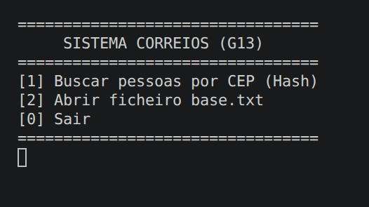
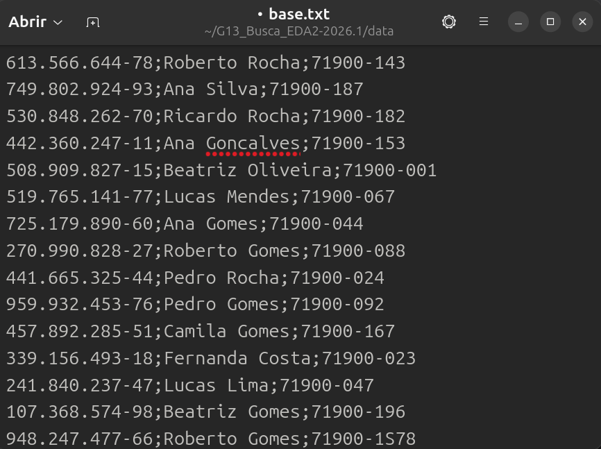
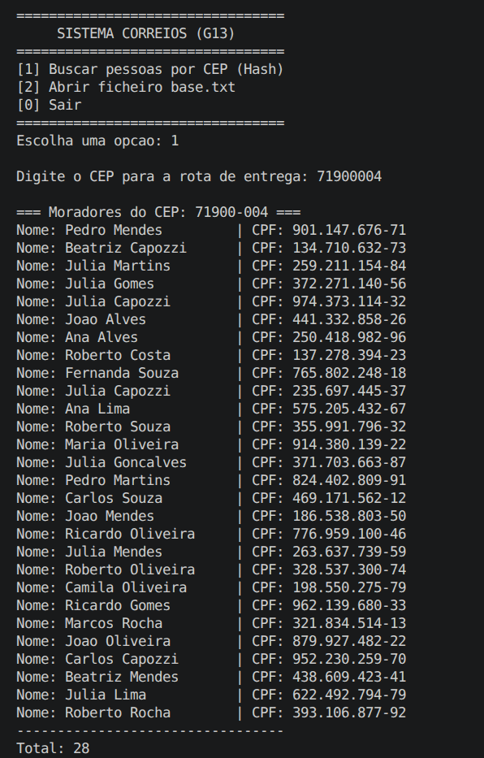
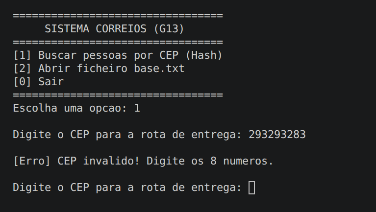

# Sistema de Busca de Entregas - Correios (G13)

**Número da Lista:** 1 (Busca)<br>
**Conteúdo da Disciplina:** Algoritmos de Busca, Tabelas Hash e Modularização em C<br>

## Alunos
| Matrícula | Aluno |
| -- | -- |
| 23/2005343 | Marcos Filho Pereira Quixabeira |
| 23/2027476 | João Guilherme Capozzi |

## Sobre 
O projeto consiste em um sistema de alta performance para a localização de moradores e rotas de entrega baseadas em CEP. 

Diferente de uma busca sequencial comum, o sistema carrega a base de dados em uma **Tabela Hash com Encadeamento**. Isso permite que, após o carregamento inicial, qualquer consulta seja realizada em tempo constante médio **$\mathcal{O}(1)$**, garantindo eficiência mesmo com milhares de registros.

### Principais Características:
* **Hashing Polinomial:** Implementação de função hash robusta para strings.
* **Tratamento de Colisões:** Uso de listas encadeadas para gerir chaves sinônimas.
* **Portabilidade:** Suporte total para Linux e Windows através de diretivas de pré-compilação.

## Vídeo de Apresentação
[](https://www.youtube.com/watch?v=ID_DO_VIDEO)

## Screenshots
### Tela Inicial


### Base de Dados


### Busca por CEP com Sucesso


### Validação de Entrada


## Instalação 
**Linguagem:** C<br>
**Compilador:** GCC<br>

### Pré-requisitos
Certifique-se de ter o `gcc` e o `make` instalados no seu sistema. No Linux (Ubuntu), você pode instalar com:
sudo apt update && sudo apt install build-essentil 

## 🛠️ Execução (Makefile)

O projeto utiliza um **Makefile** para automatizar a compilação de todos os módulos (`main.c`, `busca.c`, `arquivo.c`). Siga os comandos abaixo no terminal:

1. **Compilar o projeto:**
   ```bash
   make

2. Executar o sistema:
   ```bash
   ./buscaCorreios

3. Limpar arquivos binários (opcional):
   ```bash
   make clean

### Explicação dos Comandos:
* **`make`**: Este comando invoca o compilador `gcc` para todos os arquivos `.c` dentro da pasta `src`, gerando o executável final.
* **`./buscaCorreios`**: Executa o programa já compilado no ambiente Linux/macOS.
* **`make clean`**: Remove o executável antigo para garantir uma compilação "limpa" caso você faça alterações no código.
